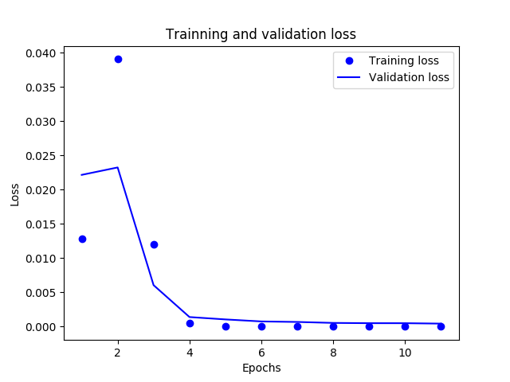
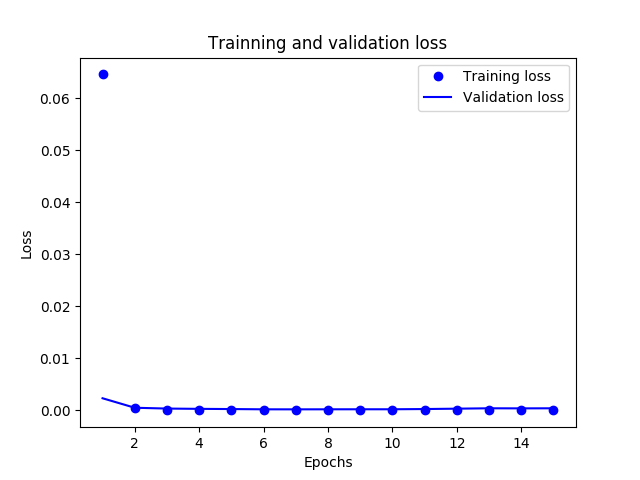
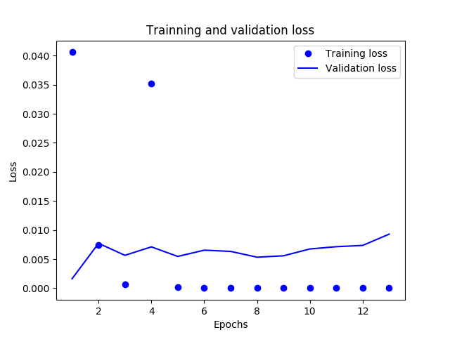
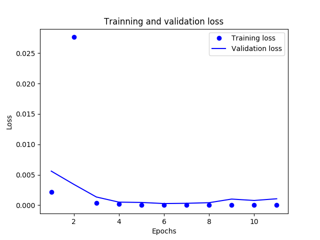
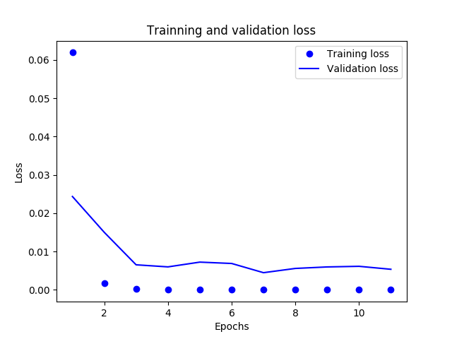

# Sign Language Digits Classification with Neural Networks
## How To Use
Clone or download the repo.
```bash
git clone https://github.com/dd-iuonac/sign-language-digits-classifier.git
```
Make sure you have installed the following libraries: numpy, keras, sklearn, tensorflow.
Navigate to sign-language-digits-classifier folder. Run the script with Python 3:
```bash
python3 main.py
```
### Sign Language Digits Dataset
The dataset used is an open-source dataset prepared by [Turkey Ankara Ayrancı Anadolu High School](http://ayrancianadolu.meb.k12.tr) Students

### Dataset Preview:

||||||
|:-:|:-:|:-:|:-:|:-:|
|0|1|2|3|4|
||||||
|5|6|7|8|9|

### Details of datasets:
- Image size: 100 x 100 pixels
- Color space: RGB
- Number of classes: 10 (Digits: 0-9)
- Number of participant students: 218
- Number of samples per student: 10

### Processing Dataset:
For processing the dataset, Arda Mavi's 'get_dataset' method has been modified and used. 
Arda Mavi's GitHub Gist: [gist.github.com/ardamavi/get_dataset.py](https://gist.github.com/ardamavi/a7d06ff8a315308771c70006cf494d69)

# Results of the Classifier





